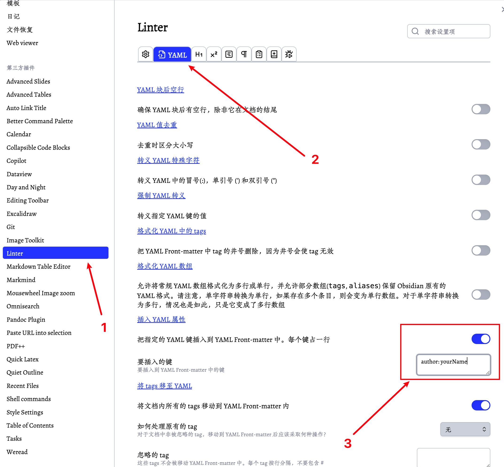

# README

## 1.插件相关

### 1.1 插件概览

| 插件名称                | 插件 URL                                                     | 插件说明                                                |
| ----------------------- | ------------------------------------------------------------ | ------------------------------------------------------- |
| Excalidraw              | https://github.com/zsviczian/obsidian-excalidraw-plugin      | 在 Obsidian 中编辑和查看 Excalidraw 绘图                |
| Git                     | https://github.com/Vinzent03/obsidian-git                    | 集成 Git 版本控制，支持自动备份和其他高级功能           |
| Dataview                | https://github.com/blacksmithgu/obsidian-dataview            | 为数据爱好者提供复杂的数据视图                          |
| Calendar                | https://github.com/liamcain/obsidian-calendar-plugin         | 日记的日历视图                                          |
| Omnisearch              | https://github.com/scambier/obsidian-omnisearch              | 一个简单易用的搜索引擎                                  |
| Linter                  | https://github.com/platers/obsidian-linter                   | 格式化和美化笔记，支持 YAML、标题、间距、数学块等格式化 |
| Weread                  | https://github.com/zhaohongxuan/obsidian-weread-plugin       | 腾讯微信读书的 Obsidian 插件                            |
| Tasks                   | https://github.com/obsidian-tasks-group/obsidian-tasks       | 跨库追踪任务，支持截止日期、重复任务、完成日期等        |
| Markmind                | https://github.com/MarkMindCkm/obsidian-markmind             | 思维导图和大纲工具                                      |
| Advanced Tables         | https://github.com/tgrosinger/advanced-tables-obsidian       | 改进的表格导航、格式化、操作和公式功能                  |
| Pandoc Plugin           | https://github.com/OliverBalfour/obsidian-pandoc             | Pandoc 导出插件，支持导出为 DOCX、ePub 和 PDF 格式      |
| Mousewheel Image Zoom   | https://github.com/nicojeske/mousewheel-image-zoom           | 使用鼠标滚轮缩放图片                                    |
| URL Into Selection      | https://github.com/denolehov/obsidian-url-into-selection     | 将 URL 转换为选中文本的链接                             |
| Quick LaTeX             | https://github.com/joeyuping/quick_latex_obsidian            | 快速输入 LaTeX 数学公式                                 |
| Better Command Palette  | https://github.com/AlexBieg/obsidian-better-command-palette  | 改进的命令面板                                          |
| Markdown Table Editor   | https://github.com/ganesshkumar/obsidian-table-editor        | Markdown 表格编辑器                                     |
| Recent Files            | https://github.com/tgrosinger/recent-files-obsidian          | 显示最近打开的文件                                      |
| Quiet Outline           | https://github.com/guopenghui/obsidian-quiet-outline         | 安静的大纲视图                                          |
| Open in New Tab         | https://github.com/patleeman/obsidian-open-in-new-tab        | 在新标签页中打开文件                                    |
| Image Toolkit           | https://github.com/sissilab/obsidian-image-toolkit           | 图片工具包，提供图片查看和编辑功能                      |
| Tag Wrangler            | https://github.com/pjeby/tag-wrangler                        | 标签管理工具                                            |
| Auto Link Title         | https://github.com/zolrath/obsidian-auto-link-title          | 自动获取链接标题                                        |
| Table of Contents       | https://github.com/hipstersmoothie/obsidian-plugin-toc       | 生成目录                                                |
| Style Settings          | https://github.com/mgmeyers/obsidian-style-settings          | 样式设置插件                                            |
| Editing Toolbar         | https://github.com/cumany/obsidian-editing-toolbar           | 编辑工具栏                                              |
| PDF Plus                | https://github.com/RyotaUshio/obsidian-pdf-plus              | 增强的 PDF 功能                                         |
| Day and Night           | https://github.com/CyberT17/obsidian-day-and-night           | 日夜主题切换                                            |
| Collapsible Code Blocks | https://github.com/stargrey/obsidian-collapsible-code-blocks | 可折叠代码块                                            |

### 1.2 `linter` 插件配置

- 需要修改 `author` 字段的名称。

### 1.3 `weread` 插件配置

- 需要添加用户自己的 `cookie`，按照 weread 插件文档操作即可。
- link: https://github.com/zhaohongxuan/obsidian-weread-plugin

### 1.4 建议补充的插件

- 推荐 `copilot` 插件，link: https://github.com/logancyang/obsidian-copilot
- 推荐 `image auto upload` 插件，link: https://github.com/renmu123/obsidian-image-auto-upload-plugin

## 2.`dataviewjs` 相关

### 2.1 `Z-Dataview` 目录说明

- `HomePage` 文件：检索项目中所有的 md 文件，统计各类元数据信息。

- `TODO` 文件：过滤项目中所有包括 todo checkbox 语法的 item。

- `TODO-files` 文件：过滤项目中所有文件名包含 `todo` 的文件。

### 2.2 各个目录下的 `overview` 文件

- 扁平化项目内部的文件树，将其变成一个一维列表，快速查看目录下所有文件名称。

## 3. 式样相关

- 本仓库使用主题：anuppuccin
- 可以在 `style settings` 插件中进行主题式样的编辑。
- 字体推荐：
  - 中文：朱雀仿宋
  - 英文：Times New Roman
  - 等宽字体：FiraCode Nerd Font

## 4. 项目目录说明

- `Z-xx` 是插件相关 or 功能性目录，比如存放 `Dataview` 或者 `Excalidraw` 等内容的目录。
- `A-xx` 是实际使用的目录，用 `A` 命名是为了字典序检索时该目录可以充分前置。
